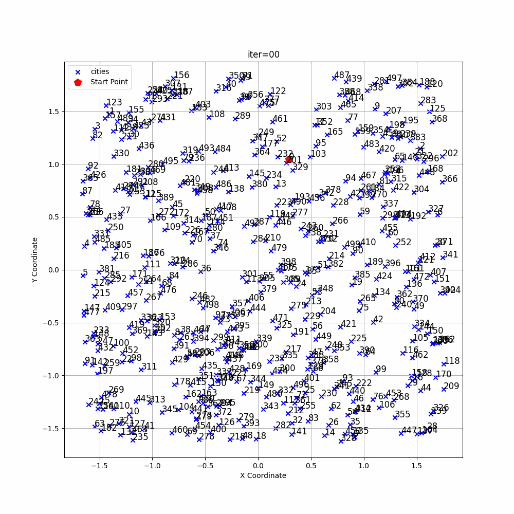
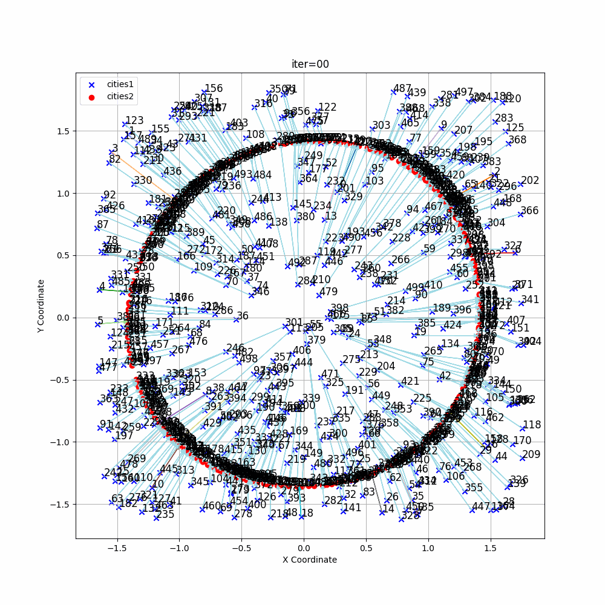
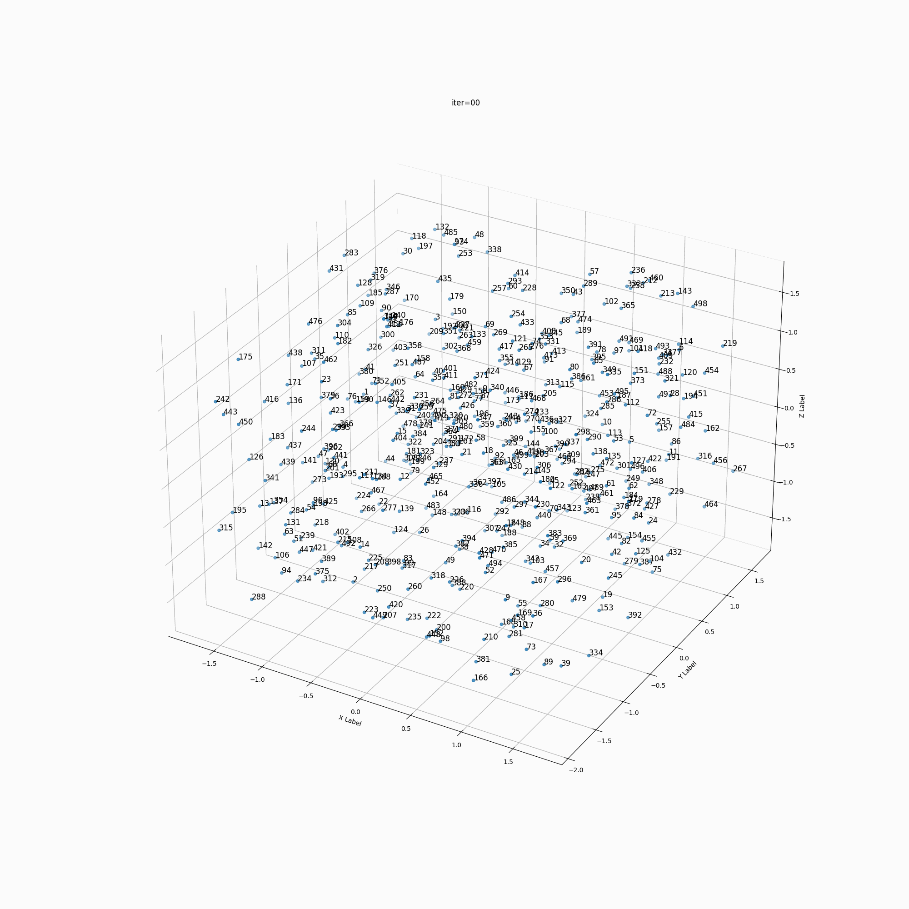

# Near Neighbor

> Findout neighbor infomation

## Neighbor Aggregation

- 2d

| class | images_att | images_cos | images_euc |
| :---: | :--------: | :--------: | :--------: |
| cities |  |  |  |
| transform |  |  |  |

- 3d

| cities | transform |
| :----: | :-------: |
|  |  |