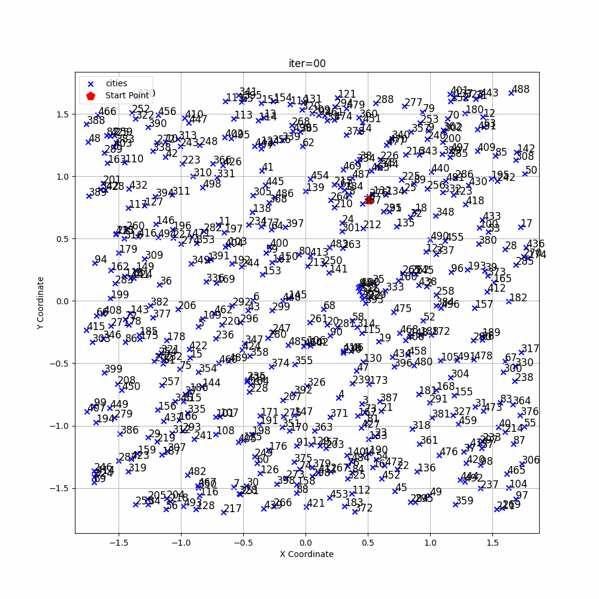
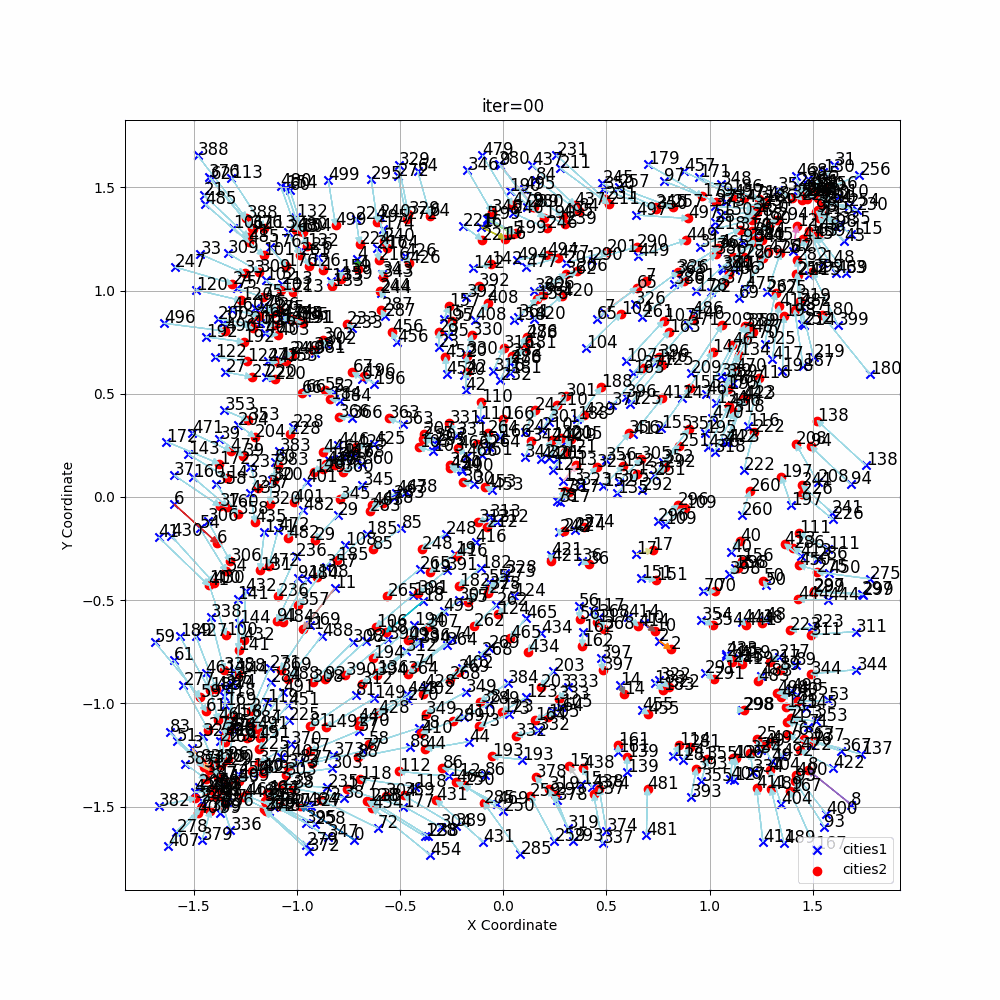

# README

> Use neighbor infomation to solve TSP Problem.

| class | images_att | images_cos | images_euc |
| ----- | ---------- | ---------- | ---------- |
| cities |  |  |  |
| transform |  |  |  |
| route |  |  |  |